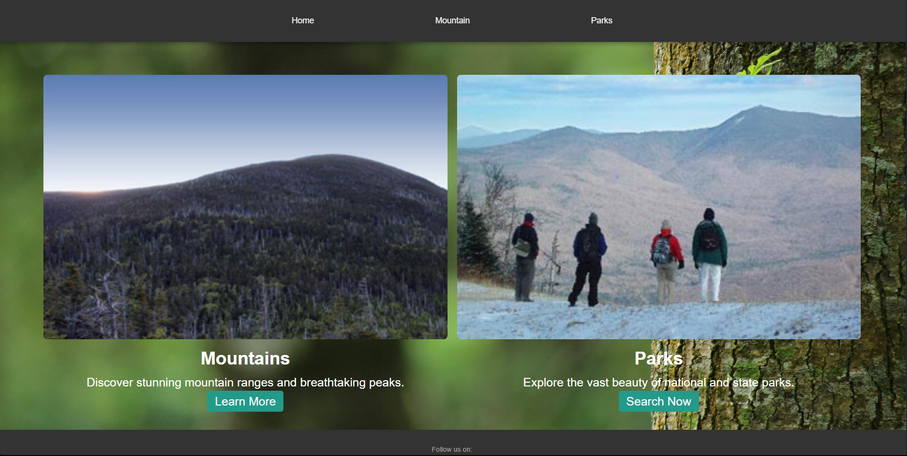

Here's a sample README for your **EnjoyTheOutdoorsCapstone** website:

---

# EnjoyTheOutdoorsCapstone

Welcome to **EnjoyTheOutdoorsCapstone**, a web application dedicated to helping users discover the beauty of the outdoors, with a focus on mountains and parks. Through this site, users can explore various natural sites, filter by location and type, and access essential details about each destination.

## Project URL

You can visit the project [here](https://jasonh16.github.io/EnjoyTheOutdoorsCapstone/index.html).

## Features

- **Mountain Search**: Users can explore different mountains, view images, and access relevant details such as elevation, description, and location.
- **Park Search**: Users can search for national and state parks, filtering results by park type and location. Each park entry includes contact details and links for further information.
- **Responsive Design**: The site is designed to be fully responsive, providing an optimal experience across all devices.
- **Modern UI Elements**: Includes stylish dropdown selectors, image slideshows, and filter sections, allowing users to interact seamlessly with the content.

## Technologies Used

- **HTML5 & CSS3**: For the structure and styling of the web pages.
- **JavaScript**: Implements dynamic functionality such as filtering, selecting, and slideshow effects.
- **GitHub Pages**: Hosts the website.

## How to Use

1. **Select Mountain or Park**: On the homepage, choose to explore either mountains or parks.
2. **Filter & Search**: Use dropdowns to select location or type to refine your search.
3. **View Details**: Click on entries to view detailed descriptions, images, and links for more information.

## Getting Started

To run this project locally:

1. Clone the repository:
   ```
   git clone https://github.com/jasonh16/EnjoyTheOutdoorsCapstone.git
   ```
2. Open `index.html` in your browser to start exploring the site.

## Future Improvements

- Adding more filters for enhanced search functionality.
- Providing user reviews or rating options for each location.
- Adding interactive maps for better navigation and exploration.

---
## Screenshots



